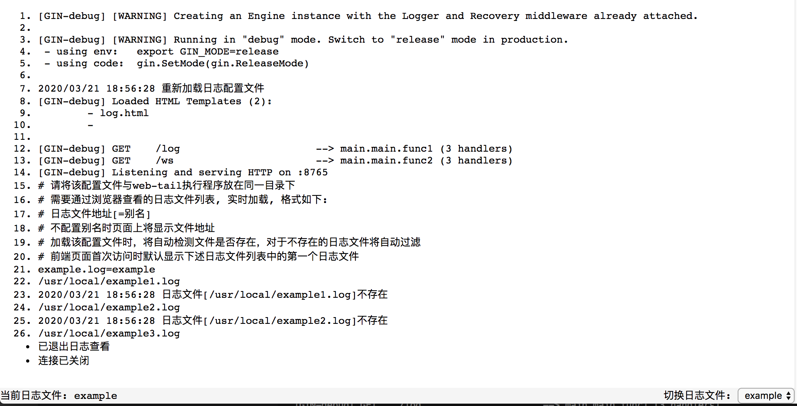

web-tail 服务端调用系统的 `tail` 命令，使用 [websocket](https://github.com/gorilla/websocket) 将需要滚动查看的日志文件显示在浏览器上，方便查看日志文件。

# 功能

> 由于web-tail底层实际上是调用系统提供的tail命令，因此该工具不适用于Windows系统

web-tail 当前包含功能如下：

- [x] 在浏览器中实时查看日志内容
- [x] 在浏览器中切换日志
- [x] 在服务端通过修改 `log.li` 配置文件即可实时添加或删除日志文件，无需重启web-tail

# 依赖

web-tail主要使用websocket技术实现日志在浏览器页面的实时滚动，web框架采用gin(以便于添加认证模块等扩展)

依赖项目如下：

- [gorilla/websocket](https://github.com/gorilla/websocket)
- [gin-gonic/gin](https://github.com/gin-gonic/gin)

# 配置

web-tail需要一个`log.li`配置文件，示例配置文件内容如下：

~~~bash
# 请将该配置文件与web-tail执行程序放在同一目录下
# 需要通过浏览器查看的日志文件列表, 实时加载, 格式如下:
# 日志文件地址[=别名]
# 不配置别名时页面上将显示文件地址
# 加载该配置文件时，将自动检测文件是否存在，对于不存在的日志文件将自动过滤
# 前端页面首次访问时默认显示下述日志文件列表中的第一个日志文件
example.log=example
/usr/local/example1.log
/usr/local/example2.log
/usr/local/example3.log
~~~

# 使用

下载web-tail代码，进入web-tail目录，构建应用

~~~bash
go build
~~~

如果要将编译后的应用放置在本机以外的其他服务器上，可以使用交叉编译，以linux-amd64为例：

~~~bash
GOOS=linux GOARCH=amd64 go build
~~~

_上传web-tail可执行文件时需一同上传配置文件`log.li`与文件夹`tmpls`_

然后根据情况修改`long.li` 配置文件后执行程序：

~~~bash
# 端口号可根据需要进行修改
# 使web-tail在后台运行执行下述命令（linux系统）
setsid ./web-tail -addr=:8765 &> web-tail.log
# 非后台运行时可执行下述命令
# ./web-tail -addr=:8765
~~~

最后打浏览器进行访问，地址：http://ip:8765/log，按`ESC`键可退出与服务器的连接，也可在页面底部右下角切换选择不同的日志进行查看:

