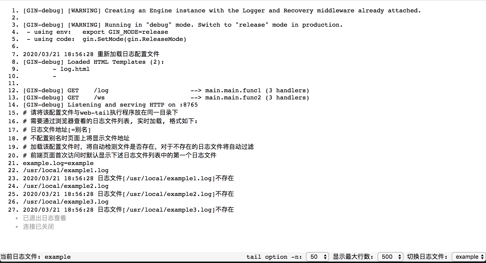

web-tail 服务端调用系统的 `tail` 命令，使用 [websocket](https://github.com/gorilla/websocket) 将需要滚动查看的日志文件显示在浏览器上，方便查看日志文件。

# 功能

> 由于web-tail底层实际上是调用系统提供的tail命令，因此该工具不适用于Windows系统

web-tail 当前包含功能如下：

- [x] 在浏览器中实时查看日志内容
- [x] 在浏览器中切换日志
- [x] 在服务端通过修改 `log.li` 配置文件即可实时添加或删除日志文件，无需重启web-tail
- [x] 支持tail -n参数
- [x] 错误与警告日志着色
- [x] 切换明暗两种主题
- [x] 全屏显示

# 依赖

web-tail主要使用websocket技术实现日志在浏览器页面的实时滚动，web框架采用gin(以便于添加认证模块等扩展)

依赖项目如下：

- [go1.13.4](https://golang.org/dl/)

- [gorilla/websocket](https://github.com/gorilla/websocket)
- [gin-gonic/gin](https://github.com/gin-gonic/gin)

# 配置

web-tail只需要一个`log.li`配置文件，配置比较简单，且支持热加载，示例配置文件内容如下：

~~~bash
# 请将该配置文件与web-tail执行程序放在同一目录下
# 需要通过浏览器查看的日志文件列表, 实时加载, 格式如下:
# 日志文件地址[=别名]
# 不配置别名时页面上将显示文件地址
# 加载该配置文件时，将自动检测文件是否存在，对于不存在的日志文件将自动过滤
# 前端页面首次访问时默认显示下述日志文件列表中的第一个日志文件
example.log=example
/usr/local/example1.log
/usr/local/example2.log
/usr/local/example3.log
~~~

# 使用

> 可以下载源码自行编译也可下载已构建好的软件包直接使用，当前提供的编译后的包为mac与linux-amd64平台

## 从二进制包启动

根据需要，下载构建好的相应系统的[二进制压缩包](https://github.com/plholx/web-tail/releases)，解压后修改`log.li`配置文件，启动`web-tail`即可

```bash
# 下载web-tail-linux-amd64.zip或web-tail-Darwin-17.7.0.zip
# 解压
unzip web-tail-linux-amd64.zip
# 进入目录
cd web-tail-linux-amd64
# 根据需要修改log.li配置文件
# 启动 根据需要修改端口号
# 后台运行(linux)
setsid ./web-tail -addr=:8765 &> web-tail.log
# 前台运行
./web-tail -addr=:8765
```

## 从源码启动

下载web-tail代码，进入web-tail目录，构建应用，默认你的系统已安装`golang` 需要的环境

~~~bash
# 构建mac系统的软件包
make build-mac
# 构建linux-amd64系统的软件包
make build-linux
# 同时构建上述两种系统的软件包
make build-all
# 其他系统架构(Windows除外)可自行修改Makefile文件进行构建
~~~

在`bin`目录下查看编译后生成的压缩包

将压缩包在本机或上传到相应的服务器上解压后，后续操作同`从二进制包启动

## 访问

打浏览器进行访问，地址：http://ip:8765/log，按`ESC`键可退出与服务器的连接或在页面右下角切换不同的日志进行查看:

